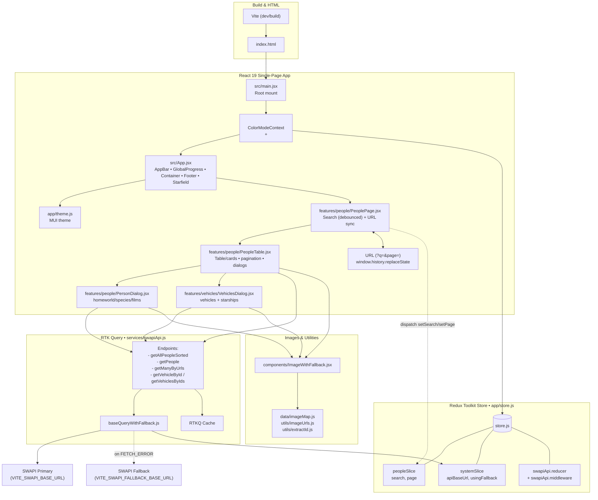

# Star Wars Data Bank - Characters & Vehicles

A single-page React app that lists **Star Wars characters** and lets you open a dialog to see their **vehicles** (I included **starships** as part of "vehicles" as useful extra). It uses **Vite → React 19 → Redux Toolkit + RTK Query → MUI** with a dark/light theme, a starfield background in dark mode, server-side **search** via SWAPI’s `?search=`, and some client-side aggregation for a better UX

---

## Quick start

### 1) Install dependencies (node v22.18.0)

```bash
npm install
```

### 2) Environment variables

Create a `.env` file in the repo root:

```
VITE_SWAPI_BASE_URL=https://swapi.py4e.com/api/
VITE_SWAPI_FALLBACK_BASE_URL=https://swapi.dev/api/
```

> **Note:** The main `swapi.dev` API currently has an expired SSL certificate (about 120 days old).  
> For reliability, I configured the app to use `swapi.py4e.com` as the primary API and `swapi.dev` as a fallback.

---

### 3) Run in development

```bash
npm run dev
```

### 4) Build & preview production

```bash
npm run build
npm run preview
```

---

## What you can do

- Browse characters in a **paginated** list (10 per page)
- **Filter by name** using SWAPI’s **server-side** search (`?search=`)
- Click **“Show vehicles”** to open a popup listing each vehicle’s **name, model, manufacturer, vehicle_class**.  
  _(Bonus: starships are shown too, clearly labeled)_
- Bonus: Open a **details** dialog for a character (homeworld, species/films, basic stats)
- Toggle **dark/light** mode (persists in localStorage)
- **letter avatar** as a fallback if an image is missing or doesn't load properly

---

## Tech decisions (and why)

- **RTK Query** for data fetching/caching: request deduping, cache keys per query arg, and parallel fetches (used by the vehicles dialog)
- **Server-side search, client-side pagination after aggregation**: search by SWAPI (as required), then aggregated matching pages are **globally sorted** desc by vehicle count, asc by name (works after searching as well)
- **Base query with primary fallback**: wraps `fetchBaseQuery` so a network failure can fallback to a mirror
- **MUI theming**: simplistic/modern look, accessible defaults, easy & quick customization
- Bonus: **Static image maps**: local WEBP assets keyed by SWAPI IDs with fallback to name initials

---

## Top-level Architecture



---

## Requirements mapping

- [x] **One-page app** with list of users (characters)
- [x] List shows **name, height, mass, gender, edited** and a **“Show vehicles”** button
- [x] **Filter by name** and do it **server-side** (`?search=`)
- [x] Clicking **“Show vehicles”** opens a popup with **vehicles: name, model, manufacturer, vehicle_class**
- [x] **ES6**, **React**, **Redux** (Redux Toolkit + RTK Query)
- [x] Build tool: **Vite**
- [x] npm modules used: **MUI**, **dayjs**

**Extras beyond the brief**

- Also lists **starships** in the vehicles dialog
- Names are clickable & display **character details** in the persons dialog
- **Dark/light** mode with local persistence and a **starfield** canvas in dark mode (to fit the theme)
- **URL sync** for `?q=` and `page=` to deep-link searches and pages
- **Global Sorting**: `O(n log n)` by vehicles count (desc) and name (asce)
- **Fallback API** support

---

## How it works (data flow)

- Search box updates local state, then dispatches `setSearch` after a **400ms debounce**
- RTK Query endpoint **`getAllPeopleSorted({ search })`** calls SWAPI with `?search=` and fetches all result pages in parallel
- Aggregated results are **globally sorted** and then **client-side paginated** (10/page)
- Clicking **Show vehicles** fetches all vehicle URLs at once; same for starships & persons details
- Top bar shows an in-flight progress bar whenever any RTK Query request is pending (Global Progress)

---

## Accessibility, performance & UX notes

- **Letter avatar** fallbacks for images for a consistent layout
- **Responsive**: table on desktop, cards on mobile; dialogs go full-screen on small screens
- **Debounced** search avoids requerying on every keystroke (400ms)
- **Parallel** fetches for related resources reduce wait time

---

## Scripts & linting

```bash
npm run dev       # start vite dev server
npm run build     # production build
npm run preview   # serve local build
npm run lint      # ESLint
```

---

## Known trade-offs

- **Global client-side sort** requires fetching all pages for the current server-filtered result; fine for SWAPI's scale and it improves the UX
- **Fallback** is attempted **only** on network errors (by design, due to the SSL certificate expiry on main API)
